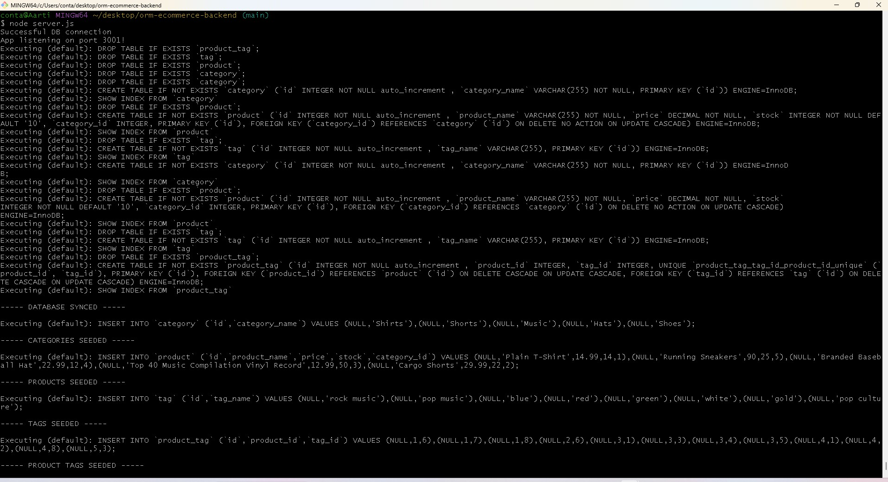
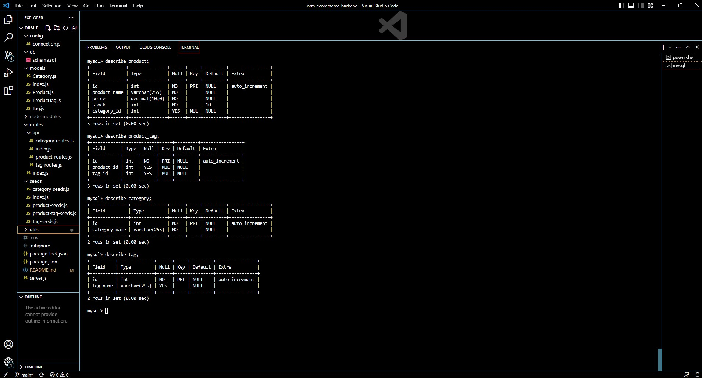
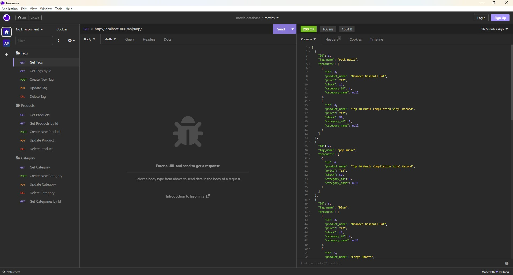

# orm-ecommerce-backend

## Description

[Walkthrough Video](https://www.youtube.com/watch?v=G84zYtRkiKk)
<br>
Internet retail, also known as e-commerce, is the largest sector of the electronics industry.E-commerce platforms like Shopify and WooCommerce provide a suite of services to businesses of all sizes. ORM Ecommerce Backend is the back end for an e-commerce site using a working Express.js API and configuring it to use Sequelize to interact with a MySQL database.

In this project , I have used the MySQL2 and Sequelize packages to connect my Express.js API to a MySQL database and the dotenv package to use environment variables to store sensitive data, like your MySQL username, password, and database name.

Given a functional Express.js API, when the user adds a database name, MySQL username, and MySQL password to an environment variable file, they are able to connect to a database using Sequelize
Once the schema and seed commands are entered, a development database is created and is seeded with test data.

The user can test API GET, POST, PUT, and DELETE routes in Insomnia Core and is able to successfully create, update, and delete data in the database.

<br>
<br>


## Technology Used 

| Technology Used         | Resource URL           | 
| ------------- |:-------------:|    
| Git | [https://git-scm.com/](https://git-scm.com/)     |  
| JavaScript | [https://developer.mozilla.org/en-US/docs/Web/JavaScript](https://developer.mozilla.org/en-US/docs/Web/JavaScript) |  
| NodeJs | [https://nodejs.org/en](https://nodejs.org/en) |
| NPM | [https://www.npmjs.com/](https://www.npmjs.com/) |
| ExpressJS | [https://www.npmjs.com/package/express](https://www.npmjs.com/package/express) |
| Inquirer | [https://www.npmjs.com/package/inquirer](https://www.npmjs.com/package/inquirer) |
| Dotenv | [https://www.npmjs.com/package/dotenv](https://www.npmjs.com/package/dotenv) |
| MySQL | [https://dev.mysql.com/doc/](https://dev.mysql.com/doc/) |
| Insomnia | [https://insomnia.rest/](https://insomnia.rest/) |
| Sequelize | [https://www.npmjs.com/package/sequelize](https://www.npmjs.com/package/sequelize) |


<br>
<br>


## Table of Contents

* [Installation](#installation)
* [Application Highlights and Usage](#application-highlights-and-usage)
* [Code Snippets](#code-snippets)
* [Learning Points](#learning-points)
* [Author Info](#author-info)
* [Credits](#credits)

<br>
<br>


## Installation

The ORM Ecommerce Backend requires installation of mysql2, express, dotenv, and sequelize. After cloning down the repository, go to the command-line in the terminal and do an 'npm install' to install all the dependencies stated in the 'package.json' file.
<br>
<br>
<br>

## Application Highlights and Usage
<br>

1. When user enters the command 'node server.js' to invoke the application, then the server is started and the Sequelize models are synced to the MySQL database:

<br>
<br>



<br>
<br>
2. When a user opens the mysql shell to view the tables the following data is shown:
<br>
<br>



<br>
<br>
3. The user can test API GET, POST, PUT, and DELETE routes in Insomnia Core by making a folder of all the APIs for all models:
<br>
<br>



<br>
<br>


## Code Snippets

<br>

 The following code snippet shows an instance of setting up the GET API route of all Tags model using sequelize instead of writing the actual query:

```javascript
router.get('/', (req, res) => {
  // find all tags
  // be sure to include its associated Product data
  // SELECT * FROM Tag INNER JOIN product ON Tag_id=Product_id
  Tag.findAll({
    include: [
      {
        model: Product,
        attributes: ['id', 'product_name', 'price', 'stock', 'category_id'],
        through: { attributes: [] }, // exclude the intermediate table
      },
    ],
  }).then(tags => {
    console.log(tags);
    res.send(tags);
  }).catch(err => {
    console.error(err);
    res.status(500).send('Error fetching tags');
  });
});

```

<br>
<br>


## Learning Points 

   I learned the following skills while doing this project:
<br>
- Java script basics (variables,functions, arrays, for-loops, if-else etc)
- How to create a dynamic backend application using the command line
- Basics of NodeJs server and related functions
- How to write database mysql queries easily (SELECT, INSERT, UPDATE, JOIN, etc.) using sequelize npm package
- Using the express, sequelize and dotenv(to store private information) packages from NPM 
- Creating models and their association to create relationships between tables using sequelize.

<br>
<br>

## Author Info

### Aarti Contractor


- Portfolio: https://aarticontractor.github.io/aarticontractor_portfolio/
- Linkedin: https://www.linkedin.com/in/aarti-contractor/
- Github: https://github.com/aarticontractor

<br>

## Credits

- https://developer.mozilla.org/en-US/docs/Web/JavaScript
- https://cloudconvert.com/webm-to-gif
- https://nodejs.org/en
- https://www.npmjs.com/package/express
- https://developer.mozilla.org/en-US/docs/Glossary/SQL
- https://www.npmjs.com/package/dotenv
- https://dev.mysql.com/doc/
- https://www.npmjs.com/package/sequelize
- https://insomnia.rest/


<br>

© 2023 edX Boot Camps LLC. Confidential and Proprietary. All Rights Reserved.